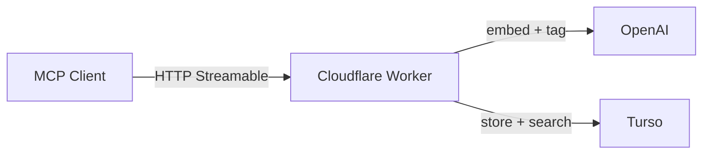

# 🧠 Memory

A remote MCP server that gives AI agents persistent, semantic memory across conversations and machines.

You say "remember this", it stores it. You ask "what did I decide about the database?", it finds the answer — even if the words don't match. All intelligence (embedding, tagging, dedup, superseding) happens server-side, so any MCP client gets the full experience without needing its own prompts.

## How It Works



When you store a thought, the server:

1. Generates an embedding via OpenAI (`text-embedding-3-small`)
2. Extracts structured metadata (type, topics, people, action items) via `gpt-4o-mini`
3. Checks for duplicates and superseded thoughts using vector similarity
4. Writes everything atomically — thought, FTS index, and any supersede updates

When you search, it runs semantic search and full-text search in parallel, merges the results, and ranks them by relevance.

## Tools

| Tool | Description |
|------|-------------|
| `remember` | Store a thought. Handles embedding, metadata extraction, dedup, and superseding automatically. |
| `recall` | Search by meaning and keyword. Hybrid semantic + full-text search with ranked results. |
| `browse` | List recent thoughts chronologically. Filter by type. |
| `forget` | Soft-delete a thought by ID. |
| `stats` | Total count, breakdown by type, superseded count, and most recent timestamp. |

## Connecting a Client

Memory uses OAuth 2.1 via Cloudflare Access. Any MCP client that supports HTTP Streamable transport can connect.

In Claude Code, add to your MCP config:

```json
{
  "mcpServers": {
    "memory": {
      "type": "url",
      "url": "https://memory.<your-subdomain>.workers.dev/mcp"
    }
  }
}
```

The server handles OAuth discovery, registration, and token exchange automatically. On first connection, you'll be redirected to Cloudflare Access to authenticate.

## Stack

- **Runtime:** Cloudflare Workers (TypeScript)
- **Database:** [Turso](https://turso.tech) — hosted SQLite with `sqlite-vec` for vector search and FTS5 for full-text search
- **Embeddings & metadata:** OpenAI (`text-embedding-3-small` + `gpt-4o-mini`)
- **MCP framework:** `@modelcontextprotocol/sdk` + `agents` (Durable Object)
- **Auth:** OAuth 2.1 via `@cloudflare/workers-oauth-provider` + Cloudflare Access

Runs entirely on free tiers (Cloudflare Workers, Turso) plus negligible OpenAI costs.

## Development

### Prerequisites

- Node.js
- A [Turso](https://turso.tech) database with the schema from `src/schema.sql` applied
- An [OpenAI API key](https://platform.openai.com/api-keys)
- A [Cloudflare Access](https://developers.cloudflare.com/cloudflare-one/applications/) application (for auth)

### Setup

```sh
npm install

# Set secrets (not checked into source)
npx wrangler secret put OPENAI_API_KEY
npx wrangler secret put TURSO_URL
npx wrangler secret put TURSO_AUTH_TOKEN
npx wrangler secret put ACCESS_CLIENT_ID
npx wrangler secret put ACCESS_CLIENT_SECRET
```

### Commands

```sh
npm run dev         # Start local dev server
npm test            # Run tests
npm run typecheck   # Type check
npm run lint        # Lint + format check
npm run lint:fix    # Auto-fix lint + format issues
npm run deploy      # Deploy to Cloudflare
```

## Further Reading

- [Vision](docs/vision.md) — what this project is and why it exists
- [Principles](docs/principles.md) — engineering principles guiding the build
