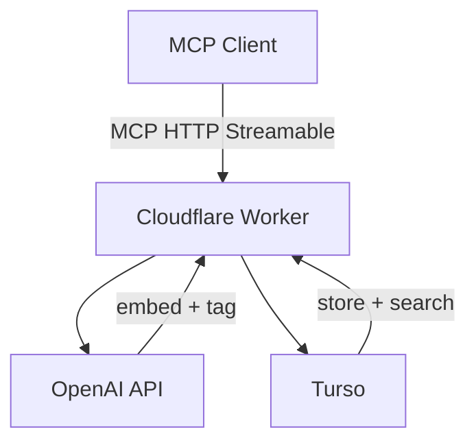

# Vision

Memory is a remote MCP server that gives AI agents persistent, semantic memory across conversations and machines.

## The Problem

Built-in memory in AI coding agents is local, opaque, and not searchable by meaning. Anything that doesn't get formally written up is lost between sessions. The agent has amnesia for the unstructured layer — fleeting thoughts, conversation fragments, offhand remarks that turn out to matter weeks later.

## What Memory Does

Memory captures thoughts in natural language and makes them retrievable by meaning. You say "remember this", it stores it. You ask "what did I decide about the database?", it finds the answer — even if the words don't match.

Five tools, one purpose:

- **remember** — capture a thought. The server handles embedding, tagging, dedup, and superseding automatically.
- **recall** — find relevant memories by meaning and keyword. Hybrid semantic + full-text search.
- **browse** — list recent thoughts chronologically.
- **forget** — soft-delete a thought.
- **stats** — overview of the memory store.

## How It Fits

Memory is the first in a planned series of MCP servers that back the personal OS (#D2). Skills define how the agent works. MCP servers store what it knows. Memory handles the unstructured layer — the complement to structured entities like tasks, projects, and decisions.

## Key Properties

- **Remote.** Works from any machine — no local process, no syncing.
- **Intelligent capture.** Raw text in, structured metadata out. The server is the smart layer.
- **Self-maintaining.** Duplicate thoughts are rejected. Evolved thinking automatically supersedes old thoughts.
- **Cheap.** Runs entirely on free tiers (Cloudflare Workers, Turso) plus negligible OpenAI costs (~$0.17/year).
